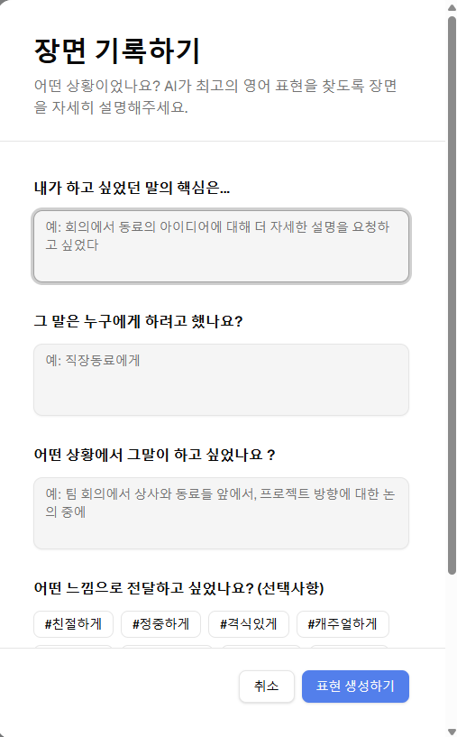
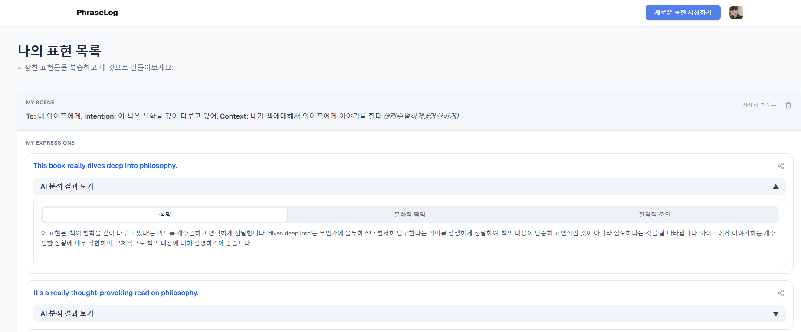
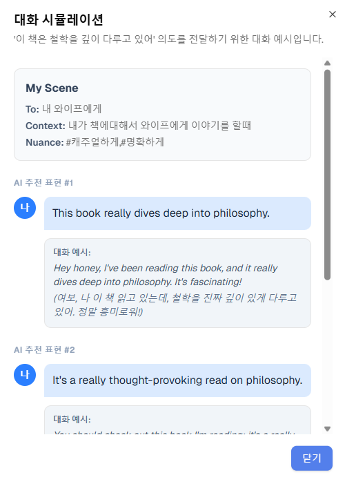

  

<h2 align="center">PhraseLog</h2>

  Your AI-Powered Coach for Real-World English Expressions ✨
   
  <a href="https://phraselog.online/"><strong>🌐 Live Website</strong></a> •
  <a href="https://github.com/yyj9529/phraselog"><strong>📦 GitHub Repository</strong></a>

  
  
  
  
  
  

---

## ✨ What is PhraseLog?

PhraseLog is more than just a translator; it's an AI-powered coach that helps you master natural, real-world English expressions. By understanding the **Context, Intention, and Nuance** of your situation, PhraseLog provides tailored suggestions, turning moments of language frustration into confident growth experiences.

-   **Scene Builder:** Describe a real-life communication challenge, and our AI will generate the perfect expressions for that specific scenario.
-   **AI Coaching & PhraseCards:** Save generated expressions to your personalized phrasebook. Dive deep into each phrase with AI-powered analysis covering its meaning, cultural context, and strategic advice.
-   **Conversation Simulation:** See how your saved expressions are used in realistic dialogues, helping you internalize the tone and flow of the conversation.

## 🧩 Tech Stack

| Category      | Technologies                                                                 |
| :------------ | :--------------------------------------------------------------------------- |
| **Frontend**  | `React Router v7` (SSR), `TypeScript`, `Vite`, `TailwindCSS`, `shadcn/ui`    |
| **Backend**   | `Supabase` (Auth, Postgres, Storage), `Edge Functions`                       |
| **Database**  | `Drizzle ORM` (Type-safe SQL Query Builder)                                  |
| **AI**        | `Google Gemini API` (Scene-aware expression generation)                      |
| **DevOps**    | `Vercel` (Hosting), `Playwright` (E2E Testing), `Sentry` (Error Monitoring)  |
| **Payments**  | `Stripe` (Subscription Billing)                                              |

## 📈 Project Highlights

-   **Production-Ready SaaS:** A fully functional, live application available at [phraselog.online](https://phraselog.online/), complete with authentication, subscription payments, and automated features.
-   **Modern Frontend Architecture:** Built with React Router v7's Server-Side Rendering (SSR) capabilities for optimized initial load performance.
-   **Mobile First & PWA:** Features a responsive, mobile-first UI and is built as a Progressive Web App (PWA) to provide a native app-like experience.
-   **End-to-End Type Safety:** Ensures robustness and maintainability with TypeScript on the frontend and Drizzle ORM for type-safe database queries.

## 📸 Screenshots

  <strong>1. Scene Input</strong> 
  

  <strong>2. Expression List & AI Analysis</strong> 
  

  <strong>3. Conversation Simulation</strong> 
  

## 🧑‍💻 Developed by

**WooJu Lee** — Full Stack Developer

-   **Email:** garethgates88@gmail.com
-   **LinkedIn:** [linkedin.com/in/wooju-lee](https://www.linkedin.com/in/wooju-lee-334b98192/)
