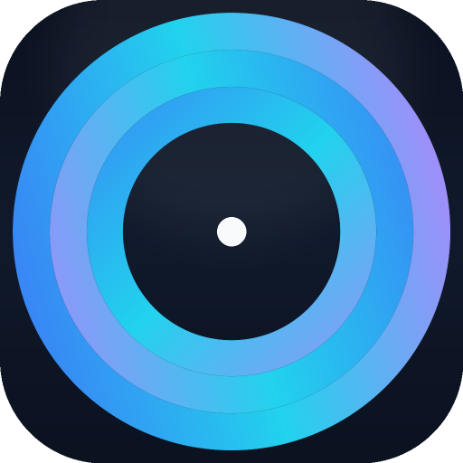

  

<h2 align="center">PhraseLog</h2>

  실전 영어 표현을 위한 AI 코치 ✨
   
  <a href="https://phraselog.online/"><strong>🌐 Live Website</strong></a> •
  <a href="https://github.com/yyj9529/phraselog"><strong>📦 GitHub Repository</strong></a>

  
  
  
  
  
  

---

## ✨ What is PhraseLog?

PhraseLog는 단순 번역기를 넘어, **상황(Context)·의도(Intention)·뉘앙스(Nuance)**를 이해하는 AI를 통해 실제 대화에서 사용할 수 있는 자연스러운 영어 표현을 코칭해주는 서비스입니다. 답답했던 언어의 장벽을 자신감으로 바꾸는 경험을 제공합니다.

-   **Scene Builder:** 내가 겪었던 구체적인 상황을 설명하면, AI가 그에 맞는 최적의 표현을 생성합니다.
-   **AI Coaching & PhraseCard:** 생성된 표현을 '나의 표현 노트'에 저장하고, 심층적인 AI 분석(의미, 문화, 전략)을 통해 학습하고 내 것으로 만듭니다.
-   **Conversation Simulation:** 저장된 Scene을 바탕으로, 추천 표현들이 실제 대화에서 어떻게 사용되는지 시뮬레이션으로 보여줍니다.

## 🧩 Tech Stack

| Category      | Technologies                                                                 |
| :------------ | :--------------------------------------------------------------------------- |
| **Frontend**  | `React Router v7` (SSR), `TypeScript`, `Vite`, `TailwindCSS`, `shadcn/ui`    |
| **Backend**   | `Supabase` (Auth, Postgres, Storage), `Edge Functions`                       |
| **Database**  | `Drizzle ORM` (Type-safe SQL Query Builder)                                  |
| **AI**        | `Google Gemini API` (Scene-aware expression generation)                      |
| **DevOps**    | `Vercel` (Hosting), `Playwright` (E2E Testing), `Sentry` (Error Monitoring)  |
| **Payments**  | `Stripe` (Subscription Billing)                                              |

## 📈 Project Highlights

-   **Production-Ready SaaS:** 실제 운영 중인 서비스([phraselog.online](https://phraselog.online/))로, 인증, 결제, 자동화 등 풀스택 기능을 모두 구현했습니다.
-   **Modern Frontend:** React Router v7의 서버 사이드 렌더링(SSR)을 도입하여 초기 로딩 성능을 최적화했습니다.
-   **Mobile First & PWA:** 모바일 환경에 최적화된 반응형 UI를 구현했으며, PWA 기술을 적용하여 앱과 같은 사용자 경험을 제공합니다.
-   **Type Safety:** TypeScript와 Drizzle ORM을 통해 프론트엔드부터 데이터베이스까지 타입 안정성을 확보했습니다.

## 📸 Screenshots

  <strong>1. 장면 기록 (Scene Input)</strong> 
  

  <strong>2. 표현 목록 및 AI 분석 (Expression List & Analysis)</strong> 
  

  <strong>3. 대화 시뮬레이션 (Conversation Simulation)</strong> 
  

## 🧑‍💻 Developed by

**이우주 (WooJu Lee)** — Full Stack Developer

-   **Email:** garethgates88@gmail.com
-   **LinkedIn:** [linkedin.com/in/wooju-lee](https://www.linkedin.com/in/wooju-lee-334b98192/)